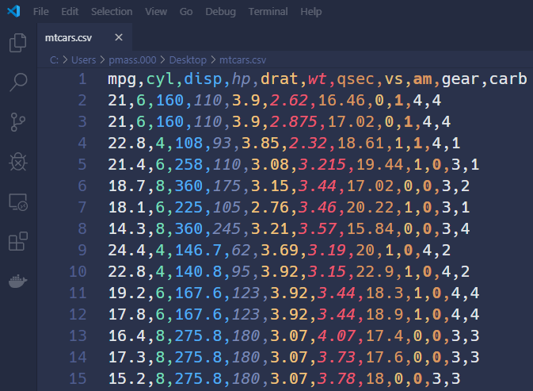
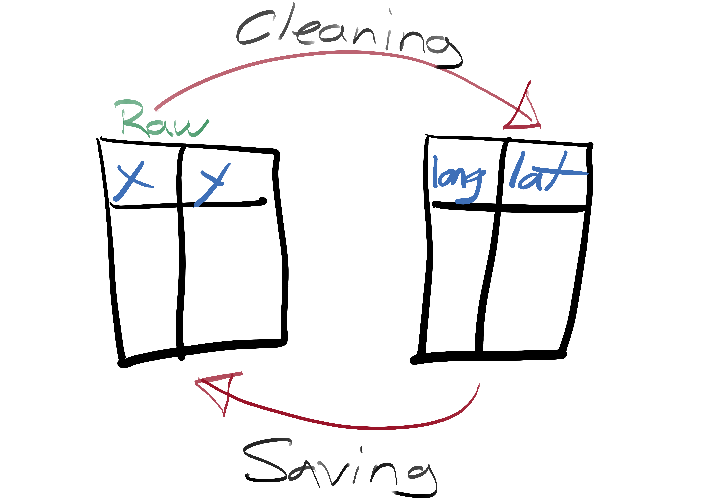
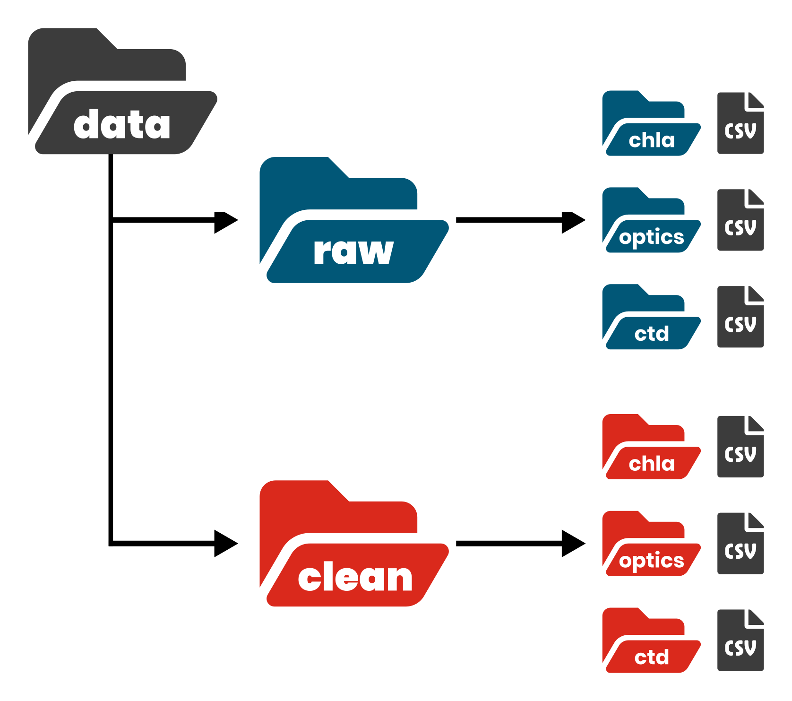
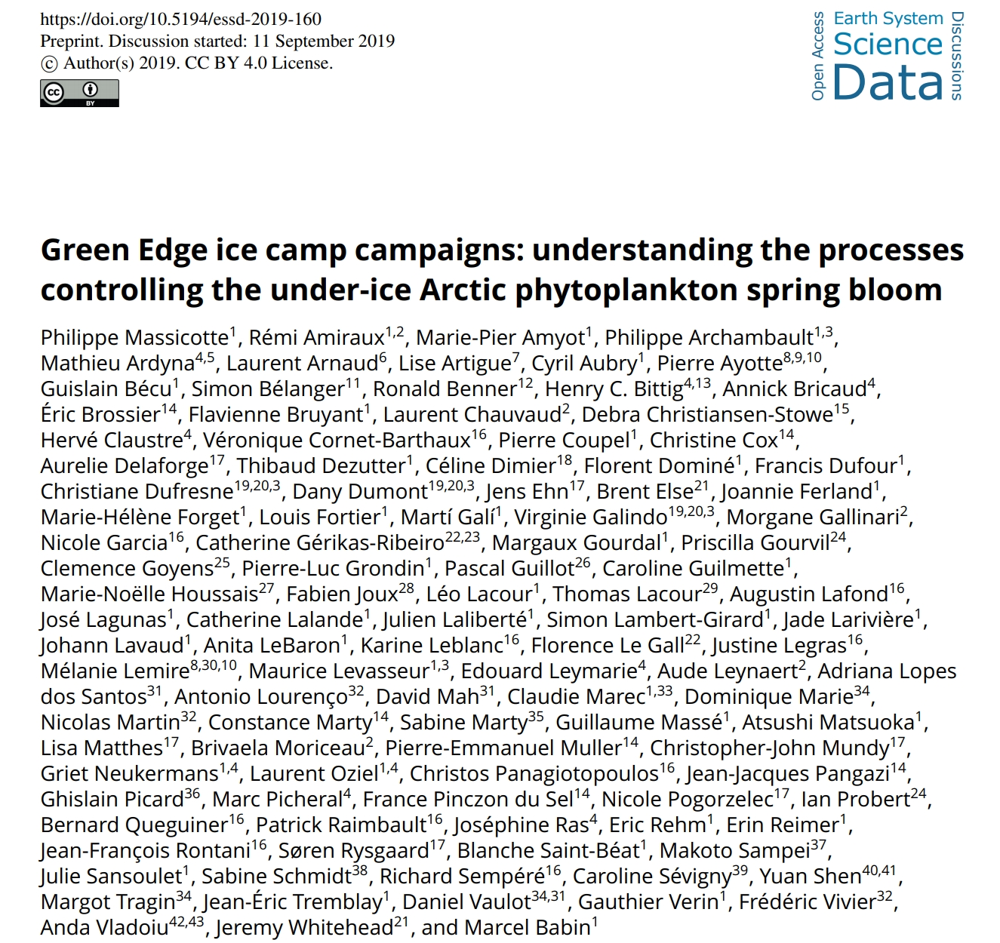
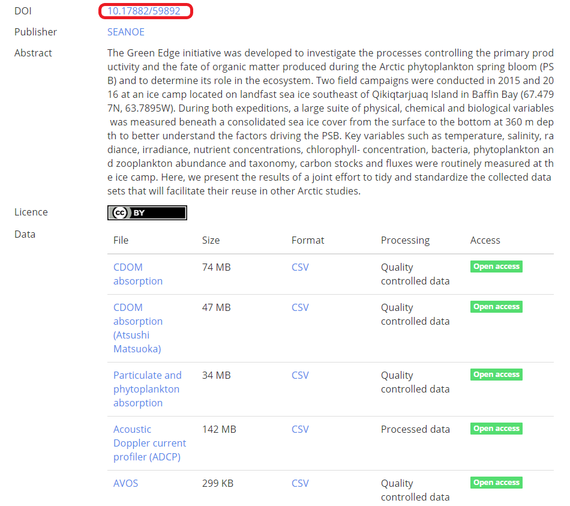

<!-- https://evamaerey.github.io/flipbooks/flipbook_recipes#49 -->

```{r setup, include=FALSE}
knitr::opts_chunk$set(
  echo = FALSE,
  dev = "svg",
  message = FALSE,
  cache = TRUE,
  warning = FALSE,
  fig.align = "center",
  fig.height = 4
)
options(htmltools.dir.version = FALSE)
# names(xaringan:::list_css())

# renv::install("rstudio/fontawesome")
# renv::install("gadenbuie/xaringanExtra")
library(tidyverse)
library(ggpmthemes)
library(patchwork)
library(flipbookr)
library(fontawesome)
library(kableExtra)
library(stars)

theme_set(theme_light_modified(base_family = "Montserrat"))
theme_update(
  strip.background = element_blank(),
  panel.border = element_blank(),
  axis.ticks = element_blank(),
  strip.text = element_text(face = "bold", size = 14),
  plot.title = element_text(size = 18, hjust = 0.5, color = "#474448")
)

htmltools::tagList(rmarkdown::html_dependency_font_awesome())
```

```{r xaringanExtra, echo=FALSE}
xaringanExtra::use_xaringan_extra(
  c(
    "tile_view",
    "animate_css",
    "tachyons"
  )
)
xaringanExtra::use_broadcast()
# xaringanExtra::use_clipboard()
# xaringanExtra::use_share_again()
```

```{r xaringanExtra-clipboard, echo=FALSE}
htmltools::tagList(
  xaringanExtra::use_clipboard(
    button_text = "Copy</i>",
    success_text = "<i class=\"fa fa-check\" style=\"color: #90BE6D\"></i>",
    error_text = "<i class=\"fa fa-times-circle\" style=\"color: #F94144\"></i>"
  ),
  rmarkdown::html_dependency_font_awesome()
)
```

```{r xaringan-animate-all, echo=FALSE}
# xaringanExtra::use_animate_all("fade")
xaringanExtra::use_tachyons()
# xaringanExtra::use_text_poster()
```

class: title-slide, center, bottom

# `r rmarkdown::metadata$title`

### *`r rmarkdown::metadata$subtitle`*


March 16, 2022 (updated: `r format(Sys.Date(), "%B %d, %Y")`)

## `r rmarkdown::metadata$author`

---

<br>

<center></center>

<p align="left">

<b>Research assistant at Takuvik (Laval University)</b><br>

- Remote sensing, modelling, data science, data visualization<br>

<br>

`r fontawesome::fa("github", fill = "#3C3C3C", height = "25px")` <small>https://github.com/PMassicotte</small> <br>

`r fontawesome::fa("envelope", fill = "#3C3C3C", height = "25px")` <small>philippe.massicotte@takuvik.ulaval.ca</small> <br>

`r fontawesome::fa("twitter", fill = "#3C3C3C", height = "25px")` <small>@philmassicotte</small> <br>

`r fontawesome::fa("blog", fill = "#3C3C3C", height = "25px")` <small>www.pmassicotte.com</small>

</p>

---

# Outlines

--

- Open file formats for your data.
    
    - Tabular data.
    
    - Geographical data.

--

- Choosing the tools to read and manipulate your data.

--

- Files and data organization.

--

- Tidying and formatting data.

--

- Backups.

--

- Publishing your data.

---

class: inverse, center, middle

# File formats

## Open file formats for your data.

<div id="container">
<div>`r fontawesome::fa("file-excel", fill = "white", height = "150px")`</div>
<div>`r fontawesome::fa("file-alt", fill = "white", height = "150px")`</div>
<div>`r fontawesome::fa("file-csv", fill = "white", height = "150px")`</div>
<div>`r fontawesome::fa("file-archive", fill = "white", height = "150px")`</div>
</div>

---
  
# File formats
  
Data file format has important implications:
  
--
  
1. Ability to **re-open** and **re-use** your data in the future.

--
  
2. Other people can read your data without fancy software that are often not cross platforms (Windows/Mac/Linux).

--
  
.left-column[`r fontawesome::fa("file-excel", fill = "#3c3c3c", height = "150px")`]
.right-column[**Example**: `.xlsx` files can not be opened in older versions of Microsoft Excel.]

---
  
# File formats
  
Ideally, the chosen file format should be:
  
--
  
1. **Non-proprietary**: open source.

--
  
2. **Unencrypted**: unless it contains personal or sensitive data.

--
  
3. **Uncompressed**: your time is more valuable than disk space.

---
  
# Common open-source text file formats
  
Tabular plain text file formats (.gradient-underline[standard text documents that contain unformatted text]):
  
- `.CSV`: Comma (or semicolon) separated values.

- `.TAB`: Tab separated values.

- `.TXT` and `.DAT`: Plain text files (.gradient-underline[data delimiter is not known]).

All these file formats can be opened using a simple text editor.

---
  
# Example of a CSV file
  
This CSV file contains 11 variables (columns). **The first line generally contains the names of the variables.**

<center>
  <figure>
      
  </figure>
</center>

---
  
## Common open-source geographic file formats
  
These files contain information of geographic features such as **points**, **lines** or **polygons**. There are a ton of [file formats](https://gisgeography.com/gis-formats/), but here are some that are particularly popular.

--

- ESRI shapefile (`.SHP`)

  - Technically, the shalefile format is not open. It is however **widely used and often considered the standard**.

  - The GeoPackage format (`.gpkg`) [is an interesting open format](https://geocompr.robinlovelace.net/read-write.html?q=geopack#file-formats).

--

- GeoJSON (`.json`, `.geojson`, JSON variant with simple geographical features)

--

- GeoTIFF (`.tif`, `.tiff`, TIFF variant enriched with GIS relevant metadata)

--

- Google Earth (`.xml`, `.kmz`, `.kml`)

---
  
# The GeoJSON format (Polygons)
  
.pull-left[

This is a simple GeoJSON file defining 3 points that form a polygon.

<small>
```json
{     
    "type": "Polygon", 
    "coordinates": [
        [30, 10], 
        [10, 30], 
        [40, 40], 
        [30, 10]
    ]
}
```
</small>
]

.pull-right[

```{r, message=FALSE, fig.height=6, fig.asp=NA}
sf_polygon <- sf::st_read('{ "type": "Polygon", 
    "coordinates": [
        [[30, 10], [10, 30], [40, 40], [30, 10]]
  ]
}', quiet = TRUE)

sf_point <- sf_polygon %>% 
  st_cast("POINT")

sf_polygon %>%
  ggplot() +
  geom_sf(size = 3, color = "#3c3c3c") +
  geom_sf(data = sf_point, size = 8, color = "red") +
  coord_sf()
```
  
]

---
  
# The GeoJSON format
  
```{r geojson, out.width="85%"}
url <-
  "https://github.com/Robinlovelace/Creating-maps-in-R/raw/master/data/test-multifeature.geojson"
sf <- geojsonsf::geojson_sf(url)
sf %>%
  ggplot() +
  geom_sf(size = 0.25) +
  labs(
    title = str_wrap(
      "The Colosseum amphitheatre in the centre of the city of Rome", 30
    ),
    caption = str_wrap("Data source: https://bit.ly/2pAjOAr", 80)
  ) +
  coord_sf() +
  theme(plot.title = element_text(size = 14, hjust = 0.5))
```

---
  
# The GeoTIFF format
  
.pull-left[
> GeoTIFF is a public domain metadata standard that allows **georeferencing information to be embedded within a TIFF file.** The potential additional information includes map projection, coordinate systems, ellipsoids, datums, and everything else necessary to establish the exact spatial reference for the file.
>
> Wikipedia
]

.pull-right[
```{r geotiff1, cache=TRUE, fig.height=5, fig.asp=NA, dev='png', dpi=300}
url <- "http://www.gisat.cz/data/mozaiky/MOS_EU_LAEA_2000.zip"
file <- curl::curl_download(url, destfile = tempfile())
file <- unzip(file, exdir = tempdir())
r <- stars::read_stars(file[2])

plot(r, rgb = c(1, 2, 3), main = NULL, downsample = TRUE)
```
]

---
  
# The GeoTIFF format (SST)

A GeoTIFF can contain information such as the Sea Surface Temperature (SST).

```{r geotiff3, cache=TRUE, fig.height=3, fig.asp=NA, dev='png', dpi=300}
poly <- read_sf('{
  "type": "FeatureCollection",
  "features": [
    {
      "type": "Feature",
      "properties": {},
      "geometry": {
        "type": "Polygon",
        "coordinates": [
          [
            [
              -66.44805908203125,
              49.814948620925776
            ],
            [
              -66.17340087890625,
              49.814948620925776
            ],
            [
              -66.17340087890625,
              49.99891228081066
            ],
            [
              -66.44805908203125,
              49.99891228081066
            ],
            [
              -66.44805908203125,
              49.814948620925776
            ]
          ]
        ]
      }
    }
  ]
}')

r <- read_stars(here::here("data/sst_st_lawrence_river.tif"))

ggplot() +
  geom_stars(data = r) +
  geom_sf(data = poly, fill = "red") +
  scale_fill_viridis_c(
    breaks = scales::breaks_pretty(n = 6),
    na.value = NA,
    guide = guide_colorbar(
      title.position = "top",
      title.hjust = 0.5,
      title.theme = element_text(family = "Montserrat", size = 8),
      label.theme = element_text(family = "Montserrat", size = 6),
      barwidth = unit(4, "cm"),
      barheight = unit(0.25, "cm")
    )
  ) +
  annotate(
    "text",
    x = -71,
    y = 47.4,
    label = "Quebec",
    family = "Montserrat",
    fontface = "bold",
    size = 4
  ) +
  annotate(
    "text",
    x = -68.52396,
    y = 48.44879,
    label = "Rimouski",
    family = "Montserrat",
    fontface = "bold",
    size = 4,
    hjust = -0.25
  ) +
  labs(
    fill = "Water temperature (°C)",
    x = NULL,
    y = NULL,
    title = "SST in the SLR (2020-01-20)"
  ) +
  theme(
    legend.justification = c(0, 0),
    legend.position = c(0.05, 0.8),
    legend.direction = "horizontal",
    legend.background = element_blank(),
    plot.title = element_text(size = 12)
  )
```

---
  
# The GeoTIFF format (SST)

A closer look allows to better visualize the values (i.e. water temperature) within each pixel.

```{r geotiff4, cache=TRUE, fig.height=3, fig.asp=NA, dev='png', dpi=300}
plot(
  round(r[poly], digits = 2),
  text_values = TRUE,
  col = colorspace::lighten(viridis::viridis(n = 10), amount = 0.25),
  key.pos = NULL,
  main = NULL
)
```


---

class: inverse, center, middle

# Efficient tools for reading large datasets in R

<center>
  <figure>
  
  </figure>
</center>

---
  
# Efficient tools for reading large datasets
  
Data science is an iterative process that can be time-consuming when working with large datasets.

<center>
<figure>
  
<figcaption><b>Artwork by</b> <a href="https://twitter.com/allison_horst?s=20">@allison_horst</a></figcaption>
</figure>
</center>

---
  
# Efficient tools for reading large datasets

.left-column[
<center>
  `r fontawesome::fa("r-project", fill = "#3c3c3c", height = "200px")`
</center>
]

.right-column[
- R is my main programming environment, so here are some recommendations to be efficient when reading files. 

- However, you can easily read all these file formats in your preferred programming language.
]
  
---
  
# R data importation tools

--

For tabular data (`.CSV`, `.TXT`, `.TAB`, `.DAT`):
  
- `readr`, `data.table` and `vroom` packages (.gradient-underline[the last two are particularly fast]).

<br>

--

For geographic data:
  
- Shapefiles, KMZ and KML: `sf`
  
- GeoJSON: `jsonlite`, `sf`, `geojson` and `geojsonsf`
  
- GeoTIFF: `terra` and `stars`
  
- For NetCDF: `ncdf4`, `tidync` and `stars`
  
---
  
# Efficient reading tools
  
```{r benchmark, cache = TRUE, results='hide'}
file <- curl::curl_download("http://eforexcel.com/wp/wp-content/uploads/2017/07/500000-Sales-Records.zip", destfile = tempfile())
file <- unzip(file, exdir = tempdir())

bm <- microbenchmark::microbenchmark(
  read.csv(file),
  readr::read_csv(file),
  vroom::vroom(file),
  data.table::fread(file),
  times = 10
)
```

```{r, fig.height=5, fig.width=10}
autoplot(bm) +
  labs(
    title = str_wrap("Benchmarks of various R functions to read a simple CSV file", 70),
    subtitle = "Time to read a CSV file with 500 000 rows and 14 columns (7 000 000 entries)."
  ) +
  theme(
    plot.title = element_text(hjust = 0)
  )
```


---

class: inverse, center, middle

# File naming and project organization

<br>

<div id="container">
<div>`r fontawesome::fa("folder-open", fill = "white", height = "150px")`</div>
<div>`r fontawesome::fa("file-csv", fill = "white", height = "150px")`</div>
<div>`r fontawesome::fa("file-alt", fill = "white", height = "150px")`</div>
</div>

---
  
# File naming
  
.gradient-underline[File naming can be a nightmare for the future you and your colleagues.]

<center>
  <figure>
      
  </figure>
  <figcaption><b>Image from:</b> https://phdcomics.com/</figcaption>
</center>
  
---
  
# File naming basic rules
  
There are few rules to adopt when naming files:
  
--
  
- Do not use special characters: **~ ! @ # $ % ^ & * ( ) ; < > ? , [ ] { } é è à**
  
--
  
- No spaces.

--
  
- Not too long (can be problematic with older software).
  - **Not so true anymore**, it is better to have a good descriptive file name.

---
  
# File naming basic rules
  
For sequential numbering, .gradient-underline[use leading zeros to ensure files sort properly].

- For example, use `0001`, `0002`, `1001` instead of  `1`, `2`, `1001`.

.pull-left[
  **Not sorted correctly**
    
```{r, results='asis'}
files <- paste0("file", c(1, 10, 2), ".csv")
sort(files) %>%
  tibble(filename = .) %>%
  knitr::kable() %>%
  kable_styling(font_size = 36)
```
]

.pull-right[
**Sorted correctly**
    
```{r}
files <-
  paste0("file", str_pad(
    c(1, 10, 2),
    width = 2,
    side = "left",
    pad = "0"
  ), ".csv")

sort(files) %>%
  tibble(filename = .) %>%
  knitr::kable() %>%
  kable_styling(font_size = 36)
```
]

---
  
# When file naming goes wrong!

.pull-left[
<center>
    <figure>
      
    </figure>
    <figcaption><b>Source:</b> https://bit.ly/2M8cViI</figcaption>  
</center>
]

.pull-right[
> The glitch caused results of a common chemistry computation to vary depending on the operating system used, causing discrepancies among **Mac**, **Windows**, and **Linux** systems.

> ...the glitch, had to do with how different operating systems sort files.
]

---
  
# When file naming goes wrong!

Data files were sorted differently depending on the operating system where the Python scripts were executed.

<center>
    <figure>
      
    </figure>
    <figcaption><b>Image from:</b> Bhandari Neupane, J. et al. Characterization of Leptazolines A–D, Polar Oxazolines from the Cyanobacterium Leptolyngbya sp., Reveals a Glitch with the “Willoughby–Hoye” Scripts for Calculating NMR Chemical Shifts. Org. Lett. 21, 8449–8453 (2019).</figcaption>  
</center>


---
  
# File naming basic rules

--

- Be consistent and descriptive when naming your files.

--

- Separate file names with `_`  or `-` to add useful information about the data:  
--

  - Project name.

--

  - The sampling locations.

--

  - Type of data/variable.

--

  - Date (YYYY-MM-DD).

--

.gradient-underline[Always use the ISO format:] <big>**YYYY**</big>-<medium>**MM**</medium>-<small>**DD**</small> (large `r fontawesome::fa("arrow-right", fill = "#d5695d")` small).

---
  
# File naming basic rules (examples)

--

`r fontawesome::fa("times", fill = "#E6352FFF")` `data.csv` (not descriptive enough)

--

`r fontawesome::fa("times", fill = "#E6352FFF")` `temperature_1.csv` (what is the meaning of **1** ?, no number padding!)

--

`r fontawesome::fa("times", fill = "#E6352FFF")` `temperature_20160708` (no file extension provided)

--

`r fontawesome::fa("check", fill = "#34A74BFF")` `station01_temperature_20160708.csv`
  
---

class: inverse, center, middle

# Working with data from other people

<center>
  <figure>
      
  </figure>
</center>
  
---
  
## Preserve information: keep your raw data raw
  
Basic recommendations to preserve the raw data for future use:
  
--
  
- Do not make any changes or corrections to the original raw data file.

--
  
- .gradient-underline[Use a scripted language to perform analysis or make corrections and save that information in a separate file.]

--
  
- If you want to do some analyses in Excel, make a copy of the file and do your calculations and graphs in the copy.

<small>Source: https://www.dataone.org/best-practices/preserve-information-keep-your-raw-data-raw</small>

---

## Preserve information: keep your raw data raw

If a script changes the content of a raw data file, it is likely that the same script will not work again the second time you run it because the structure of the file has changed.

<center>
  <figure>
      
  </figure>
</center>

---
  
# Project directory structure

--

- Choosing a logical and consistent way to organize your data files makes it easier for you and your colleagues to find and use your data.

--

- Consider using a specific folder to store raw data files. 

--

- In my workflow, I use a folder named `raw` in which I consider files as **read-only**.

--

- Data files produced by code are placed in a folder named `clean`.

---
  
# Project directory structure
  
The way I structure my `data` folder.

<center>
  <figure>
      
  </figure>
</center>
  
---

class: inverse, center, middle

# Tidy data

> It is often said that **80% of the data analysis is dedicated to cleaning and data preparation**. And this is not only a first step, but it must be repeated several times during the analysis as new problems arise or new data is collected.

---
  
# Tidy data
  
Why do we want tidy data?

--

- Well-formatted data allows for quicker **visualization**, **modeling**, **manipulation** and **archiving**.

--

Whatever the language used (R, Python, Matlab, etc.), there are several tools to tidy your data.

<br>

<center>
<div id="container">
<div>`r fontawesome::fa("r-project", fill = "#3c3c3c", height = "200px")`</div>
<div>`r fontawesome::fa("python", fill = "#3c3c3c", height = "200px")`</div>
</div>
</center>

---
  
# Tidy data
  
The main idea is that data should be organized in columns with **each column representing only a single type of data** (character, numerical, etc.).

<center>
<figure>
  
<figcaption>
    <b>Artwork by</b> <a href="https://twitter.com/allison_horst?s=20">@allison_horst</a>
</figcaption>
</figure>
</center>

---

# How data is often structured

Many researchers structure their data in such a way that it is easily manipulated by a human, **but not so much programatically**.

!!!ADD THE THREE PLANT IMAGES HERE!!!

Klady, Rebecca A, Henry, Gregory HR, and Lemay, Valerie. 2017. [Flower and seed biomass, and germination rate of arctic tundra plants in response to long term experimental warming. doi:10.1594/PANGAEA.812091. ](https://search.dataone.org/view/doi%3A10.1594%2FPANGAEA.812091)

---

# How data is often structured

One common mistake is that information (such as **species**) are contained within column names.

```{r}
# https://doi.pangaea.de/10.1594/PANGAEA.812091?format=zip
df <- read_delim(
    here::here("data", "Alexandra_Fiord_flower-biom.tab"),
    skip = 19,
    delim = "\t"
  )

df %>% 
  kable() %>%
  kable_styling(font_size = 14)
```

---

# How data should be structured

After proper transformations, the data is now tidy ([or in normal form](https://en.wikipedia.org/wiki/Database_normalization)). **Each column is a variable, each row is an observations.**

```{r}
df_pivoted <- df %>%
  janitor::clean_names() %>% 
  pivot_longer(
    c(ends_with("_g"), ends_with("_dev")),
    names_to = c("species", ".value"),
    names_pattern = "(.*)(_flower_biom_g|_std_dev$)",
    values_drop_na = TRUE
  ) %>%
  rename(biomass_grams = contains("flower")) %>%
  rename(standard_deviation_grams = contains("_std_dev"))

df_pivoted %>%
  head(10) %>% 
  kable() %>%
  kable_styling(font_size = 16)
```

---

# Easier to work with tidy data

Graphics, statistical analysis and models are easier to make with tidy data.

```{r plot_plant_biomass, out.width="80%", cache=TRUE}
df_pivoted %>% 
  ggplot(aes(x = exp_treat, y = biomass_grams, fill = vegetation_type)) +
  geom_boxplot(size = 0.1) +
  labs(
    x = NULL,
    y = "Plant biomass (g)"
  ) +
  paletteer::scale_fill_paletteer_d("fishualize::Antennarius_commerson") +
  theme(
    legend.justification = c(0, 0),
    legend.position = c(0.05, 0.7),
    legend.title = element_blank(),
    legend.text = element_text(family = "Montserrat Light")
  )
```

---

# Keep your data as rectangle tables
  
**One more note:** if you use a spreadsheet program, keep your data arranged as rectangular tables. Otherwise, .gradient-underline[it makes data importation difficult]. 
  
.pull-left[
    <center></center>
]

.pull-right[
  <center></center>
]

---

class: inverse, center, middle

# Variable names

## How to choose variable names when creating data files?

---
  
# Variable names
  
--

.gradient-underline[Be consistent with variable name capitalization:]

`r fontawesome::fa("check", fill = "#34A74BFF")` `temperature`, `precipitation`

`r fontawesome::fa("check", fill = "#34A74BFF")` `Temperature`, `Precipitation`

--

.gradient-underline[Avoid mixing name capitalization:]

`r fontawesome::fa("times", fill = "#E6352FFF")` `temperature`, `Precipitation`

`r fontawesome::fa("times", fill = "#E6352FFF")` `temperature_min`, `TemperatureMax`

---
  
# Variable names

--

- Do not forget to provide information about abbreviations.

    - `tmin` vs `temperature_maximum`

--

- Do not use special characters or spaces (same as for file names).

--

- Explicitly state the unit of each variable:

    - `depth_m`, `chla_mg_m2`
  
--

- Be consistent with variable names .gradient-underline[across files]:
  - `temp` vs `temperature`
  
---
  
# Missing values
  
--

- Missing values should be simply represented by **space** in your data files.

--

- R, Python, Matlab and other programming languages deal well with this.

--

- If not possible, use a standardized code to represent missing values:
    - `NA`, `NaN`

--

- `r fontawesome::fa("exclamation-triangle", fill = "#ffb82a")` .gradient-underline[Do not use a numerical value (ex.: **-999**) to indicate missing values.]

    - This can create situations where missing values will be included in calculations.

---
  
# Visualization
  
--

- Once data is tidy, .gradient-underline[**perform a visual inspection**] to make sure there are no obvious errors in your data.

--

- A picture is worth a thousand words.
    - <span class = "gradient-underline">**Always, always, always plot the data!**</span>
  
--

- A histogram can be used to represent the distribution of numerical data.

---
  
# Visualization

In this example, we see that there is an outlier in the data. Measuring device fault? Manual entry error?
  
```{r, fig.height=4, fig.asp=NA}
df <- read_csv("https://raw.githubusercontent.com/tidyverse/tidyr/master/vignettes/weather.csv")

df <- df %>% pivot_longer(-c(id:element), names_to = "day", values_to = "temperature") %>%
  drop_na() %>%
  mutate(day = parse_number(day)) %>% 
  filter(element == "tmin")


df$temperature[12] <- 123

df_arrow <- tibble(
  x = 110,
  xend = 123,
  y = 5,
  yend = 2.2,
  label = "Outlier?"
)

df %>%
  ggplot(aes(x = temperature)) +
  geom_histogram(binwidth = 5) +
  labs(
    title = "Histogram of air temperature",
    subtitle = str_wrap("A histogram is an accurate representation of the distribution of numerical data. Here we can observe that there is an outlier in the data.", 90)
  ) +
  geom_curve(
    data = df_arrow,
    aes(x = x, y = y, xend = xend, yend = yend),
    curvature = -0.3,
    arrow = arrow(length = unit(0.03, "npc")),
    size = 0.5,
    color = "#E60505FF"
  ) +
  geom_text(
    data = df_arrow,
    aes(x = x, y = y, label = label),
    hjust = 1.1,
    fontface = "bold",
    color = "#E60505FF",
    size = 6
  ) +
  xlab("Temperature (°C)") +
  ylab("Count")
```

---

class: inverse, center, middle

# Backups

## The question is not *if*, but *when* your hard drive will fail.

`r fontawesome::fa("hdd", fill = "white", height = "200px")`

---
  
# Backups vs Archives

--

**Backups**

> Backup is a copy of data created to restore said data in case of damage or loss. **The original data is not deleted after a backup is made.**

--

**Archives**

> An archive is a copy of data created for reference purposes. **Although not required, the original is often deleted after an archive is made.**

<credit><b>Source:</b> https://www.networkworld.com/article/3285652/backup-vs-archive-why-its-important-to-know-the-difference.html</credit>

---
  
# Importance of backups
  
--

- .gradient-underline[**Disk space is much cheaper than the time you invested in collecting, cleaning and analyzing your data.**]

--

- It is important to have **redundancy** in your data.
    - `r fontawesome::fa("exclamation-triangle", fill = "#ffb82a")` <span class = "gradient-underline">A copy of your working directory in another directory on the same hard drive is not redundancy!</span>

--

- Backups should not be only done on your computer (use cloud services)
    
    - Google Drive
    
    - Microsoft OneDrive (1TB of space if a student at Université Laval)
  
    - Dropbox
    
    - MEGA

---
  
# Importance of backups
  
- Use an incremental strategy to backup your data (.gradient-underline[ideally on a daily basis]).

    - [rsync](https://fr.wikipedia.org/wiki/Rsync)

    - [SyncBack](https://www.2brightsparks.com/syncback/syncback-hub.html)

    - [Duplicati](https://www.duplicati.com/)

    - [Syncthing](https://syncthing.net/)

- I keep 3 months of data.


---
  
# Version control
  
- Backups of the source code used to generate data are also important.

- Git is a version control system used to keep track of changes in computer files.
    
    - Primarily used for source code management in software development.
    
    - Coordinating work on those files among multiple people.


<div id = "container">
<div></div>
<div></div>
<div></div>
</div>

---

class: inverse, center, middle

# Publishing your data

## Making your data available to the community

---
  
# Publishing your data
  
Many journals and [funding agencies](http://www.science.gc.ca/eic/site/063.nsf/fra/h_97610.html) now require to have archiving strategies. Why?
  
--

- Makes your data shareable (do not forget that research if funded with public money).

--

- Makes your data discoverable.

--

- Makes your data citable (DOI, Digital Object Identifier).
    
    - Collecting and producing data is difficult and requires a lot of resources (technical and financial). 
    
    - Publishing your data allows other people to credit you for your hard work.

--

- Others can find and correct errors in your data.

--

- Data can be re-used in other studies to build up knowledge.

---

# Publishing your data
  
There are at least two different ways to make your data available:
  
1. In a dedicated data paper.

2. In an appendix along with your paper (**assuming that your paper is published in an open-access journal**).
  - [The Directory of Open Access Journals](https://www.doaj.org/) is useful to search for open access journal. 

<br>

<center>
  <figure>
      
  </figure>
  <figcaption>https://www.doaj.org/</figcaption>
</center>

---

# Public announcement

--

<p style="font-size:38px">.gradient-underline[**Summary tables in an PDF article are not very useful!**]</p>

<center>
  <figure>
  
  </figure>
</center>

--

You should rather provide the data in a way that is easily importable into a programming language as supplementary information (for example, a `CSV` file).

---
  
# What is a data paper?
  
- .gradient-underline[Data presented in an appendix are rarely reviewed by peers.]
  
- Data papers are interesting alternatives to publish data:
  
  - **Peer-reviewed** (high-quality data).
  
  - Generally open access (obliviously!).
  
  - Data are citable with a DOI.

> A data paper is a **peer-reviewed document** describing a dataset, published in a peer-reviewed journal. It takes effort to prepare, curate and describe data. Data papers provide recognition for this effort by means of a scholarly article.
>
> https://www.gbif.org/data-papers

---

# What is a data paper?
  
A data paper is similar to a traditional scientific paper.

<center>
  <figure>
      
  </figure>
</center>
  
---
  
# What is a data paper?
  
The data associated with the paper is available online.

<center>
  <figure>
      
  </figure>
</center>
  
---
  
# Open repositories

There are many options available to publish your data.
  
- Polar Data Catalogue (https://www.polardata.ca/)
- Scholars Portal Dataverse (https://dataverse.scholarsportal.info/)
- Federated Research Data Repository (https://www.frdr-dfdr.ca/repo/?locale=fr)
- Pangaea (https://www.pangaea.de/)
- Dryad (https://datadryad.org)
- Catalogue de données ouverte OGSL (https://ogsl.ca/fr/)
- Zenodo (https://zenodo.org/)
- Figshare (https://figshare.com/)
- Seanoe (https://www.seanoe.org/)
- NFS Arctic Data Center (https://arcticdata.io/)
- The Dataverse Project (https://dataverse.org/)

---

class: inverse, center, middle

# Take home messages

---
  
# Take home messages
  
--

- Choose non-proprietary file formats (ex.: `CSV`).

--

- Give your files and variables meaningful names.

--

- Tidy and visually explore your data to remove obvious errors.

--

- .gradient-underline[**Backups your data externally as often as possible.**]
    - Your hard drive will eventually crash, for sure!

--

- Use a version control system (git) for your analysis scripts.

--

- When possible, share the data and the scripts that were used in your research papers.
