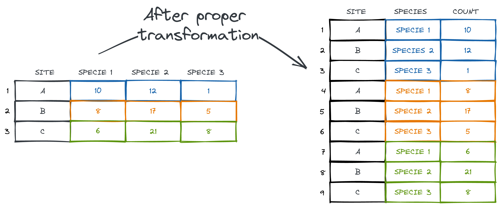

```{r setup, include=FALSE}
knitr::opts_chunk$set(
  echo = FALSE,
  dev = "svg",
  message = FALSE,
  cache = FALSE,
  warning = FALSE,
  fig.align = "center",
  fig.height = 4
)

options(htmltools.dir.version = FALSE)

# renv::install("ropensci/rnaturalearthdata")
# renv::install("ropensci/rnaturalearthhires")
library(tidyverse)
library(ggpmthemes)
library(patchwork)
library(fontawesome)
library(stars)
library(gt)
library(fontawesome)
library(xaringanExtra)
library(breakerofchains)
library(pathformatr)
library(rnaturalearthdata)
library(rnaturalearthhires)
library(tidytext)
library(janitor)

theme_set(theme_light_modified(base_family = "Montserrat"))
theme_update(
  strip.background = element_blank(),
  panel.border = element_blank(),
  axis.ticks = element_blank(),
  strip.text = element_text(face = "bold", size = 14),
  plot.title = element_text(size = 18, hjust = 0.5, color = "#474448")
)

htmltools::tagList(rmarkdown::html_dependency_font_awesome())
```

```{r xaringanExtra, echo=FALSE}
xaringanExtra::use_xaringan_extra(
  c(
    "tile_view",
    "animate_css",
    "tachyons"
  )
)
xaringanExtra::use_broadcast()
# xaringanExtra::use_clipboard()
# xaringanExtra::use_share_again()
```

```{r xaringanExtra-clipboard, echo=FALSE}
htmltools::tagList(
  xaringanExtra::use_clipboard(
    button_text = "Copy</i>",
    success_text = "<i class=\"fa fa-check\" style=\"color: #90BE6D\"></i>",
    error_text = "<i class=\"fa fa-times-circle\" style=\"color: #F94144\"></i>"
  ),
  rmarkdown::html_dependency_font_awesome()
)
```

```{r xaringan-animate-all, echo=FALSE}
xaringanExtra::use_tachyons()
```

class: title-slide, center, bottom

# `r rmarkdown::metadata$title`

### _`r rmarkdown::metadata$subtitle`_


## `r rmarkdown::metadata$author`

January 31, 2024 (updated: `r format(Sys.Date(), "%B %d, %Y")`)

---

<br>

<center></center>

<p align="left">

<b>Research assistant at Takuvik (Laval University)</b><br>

- Remote sensing, modelling, data science, data visualization, programming<br>

<br>

`r fontawesome::fa("github", fill = "#3C3C3C", height = "25px")` <small>https://github.com/PMassicotte</small> <br>

`r fontawesome::fa("envelope", fill = "#3C3C3C", height = "25px")` <small>philippe.massicotte@takuvik.ulaval.ca</small> <br>

`r fontawesome::fa("twitter", fill = "#3C3C3C", height = "25px")` <small>@philmassicotte</small> <br>

`r fontawesome::fa("mastodon", fill = "#3C3C3C", height = "25px")` <small>https://fosstodon.org/@philmassicotte</small> <br>

`r fontawesome::fa("blog", fill = "#3C3C3C", height = "25px")` <small>www.pmassicotte.com</small>

</p>

---

# Outlines

--

- Open file formats for your data.

  - Tabular data.
  - Geographical data.

--

- Choosing the tools to read and manipulate your data.

--

- Files and data organization.

--

- Tidying and formatting data.

--

- Backups.

--

- Publishing your data.

---

class: inverse, center, middle

# File formats

## Open file formats for your data.

<div id="container">
<div>`r fontawesome::fa("file-excel", fill = "white", height = "150px")`</div>
<div>`r fontawesome::fa("file-alt", fill = "white", height = "150px")`</div>
<div>`r fontawesome::fa("file-csv", fill = "white", height = "150px")`</div>
<div>`r fontawesome::fa("file-archive", fill = "white", height = "150px")`</div>
</div>

---

# File formats

The file format used to store data has important implications:

- Allows to .background-highlight[re-open] and .background-highlight[re-use] your data in the future:

  - Softwares might not be cross-platform (Windows/Mac/Linux).

  - Proprietary file formats can become obsolete or unsupported.

<center>
<div id="container">
<div>`r fontawesome::fa("windows", fill = "#3c3c3c", height = "75px")`</div>
<div>`r fontawesome::fa("apple", fill = "#3c3c3c", height = "75px")`</div>
<div>`r fontawesome::fa("linux", fill = "#3c3c3c", height = "75px")`</div>
</div>
</center>

--

.left-column[`r fontawesome::fa("file-excel", fill = "#3c3c3c", height = "100px")`]
.right-column[**Example**: `.xlsx` files can not be opened in older versions of Microsoft Excel.]

---

# Old-school computing in laboratories

.pull-left[

Laboratory computer programs often use proprietary file formats.

This likely means that:

1. You will be forced to buy a license .background-highlight[which can be expensive].

2. You depend on the commitment of the company to support the file format in the future.

]

.pull-right[

<center>
    <figure>
      
    </figure>
    <figcaption>Photo by <a href="https://unsplash.com/@cdc?utm_source=unsplash&utm_medium=referral&utm_content=creditCopyText">CDC</a> on <a href="https://unsplash.com/s/photos/lab-computer?utm_source=unsplash&utm_medium=referral&utm_content=creditCopyText">Unsplash</a>
    </figcaption> 
]

---

# Old-school computing in laboratories

When you depend on profit companies.

.pull-left[

> At the Bodega Marine Laboratory at the University of California, Davis, some computers still run on **Microsoft Windows XP (released in 2001)**, because of the need to maintain compatibility with a scanning laser confocal microscope and other imaging equipment, says lab director Gary Cherr.

> **To work with current Windows versions, the team would have to replace the whole microscope. The marginal potential gains aren’t yet worth the US$400,000 expense**, Cherr reasons.

Source: [Old-school computing: when your lab PC is ancient](https://www.nature.com/articles/d41586-021-01431-y)

]

.pull-right[

<center>
    <figure>
      
    </figure>
    <figcaption>Photo by <a href="https://unsplash.com/@moreno303?utm_source=unsplash&utm_medium=referral&utm_content=creditCopyText">Misael Moreno</a> on <a href="https://unsplash.com/s/photos/microscope?utm_source=unsplash&utm_medium=referral&utm_content=creditCopyText">Unsplash</a>
    </figcaption> 
</center>
]

---

# File formats

Ideally, the chosen file format should have these characteristics:

--

1. .background-highlight[Non-proprietary]: open source.

--

2. .background-highlight[Unencrypted]: unless it contains personal or sensitive data.

--

3. .background-highlight[human-readable]: the file should be human-readable **or** have tools available for reading and writing.

--

4. .background-highlight[Performance]: consideration for efficient read and write operations, especially for large datasets, is crucial for optimal performance (less important if you work with small datasets).

---

# Common open-source text file formats

Tabular plain text file formats (.background-highlight[standard text documents that contain unformatted text]):

- `.CSV`: Comma (or semicolon) separated values.

- `.TAB`: Tab separated values.

- `.TXT` and `.DAT`: Plain text files (.background-highlight[data delimiter is not known]).

All these file formats can be opened using a simple text editor.

---

# Examples of CSV and TSV files

<!-- Screenshots made using maim -->
<!-- maim ~/Desktop/penguins_tsv_format.png -g 1300x725+4070+210 -->

This dataset contains 4 variables (columns). .background-highlight[The first line generally contains the names of the variables.]

.pull-left[
A comma-separated values file (`.csv`).

  <figure>
      
  </figure>
]

.pull-right[
A tabs separated values file (`.tsv`).

  <figure>
      
  </figure>
]

<small>
Data source: Horst AM, Hill AP, Gorman KB (2020). palmerpenguins: Palmer Archipelago (Antarctica) penguin data. R package version 0.1.0. https://allisonhorst.github.io/palmerpenguins/.
</small>

---

## Common open-source geographic file formats

These files contain information on geographic features such as .background-highlight[points], .background-highlight[lines] or .background-highlight[polygons]. There are a ton of [geographical file formats](https://gisgeography.com/gis-formats/), but here are some that are particularly popular.

--

- ESRI shapefile (`.SHP`)

  - Technically, the shapefile format is not open. .background-highlight[It is however widely used and often considered the standard].

--

- The GeoPackage format (`.gpkg`) [is an interesting open format](https://geocompr.robinlovelace.net/read-write.html?q=geopack#file-formats).

--

- GeoJSON (`.json`, `.geojson`, JSON variant with simple geographical features)

--

- GeoTIFF (`.tif`, `.tiff`, TIFF variant enriched with GIS relevant metadata)

--

- GeoParquet (`.parquet`) is an incubating [Open Geospatial Consortium (OGC) standard](https://geoparquet.org/) standard that adds interoperable geospatial types (Point, Line, Polygon) to [Apache Parquet](https://parquet.apache.org/).

---

# The GeoJSON format (Polygons)

.pull-left[

This is a simple GeoJSON file defining 3 points that form a polygon.

<small>
```json
{     
    "type": "Polygon", 
    "coordinates": [
        [30, 10], 
        [10, 30], 
        [40, 40], 
        [30, 10]
    ]
}
```
</small>

**Create your own GeoJSON file online:**

- [https://geojson.io/](https://geojson.io/)
  ]

.pull-right[

```{r, message=FALSE, fig.height=6, fig.asp=NA}
sf_polygon <- sf::st_read('{ "type": "Polygon",
    "coordinates": [
        [[30, 10], [10, 30], [40, 40], [30, 10]]
  ]
}', quiet = TRUE)

sf_point <- sf_polygon |>
  st_cast("POINT")

sf_polygon |>
  ggplot() +
  geom_sf(linewidth = 3, color = "#3c3c3c") +
  geom_sf(data = sf_point, size = 8, color = "red") +
  coord_sf()
```

]

---

# The GeoJSON format

```{r geojson, out.width="85%"}
url <-
  "https://github.com/Robinlovelace/Creating-maps-in-R/raw/master/data/test-multifeature.geojson"
sf <- sf::st_read(url, quiet = TRUE)
sf |>
  ggplot() +
  geom_sf(linewidth = 0.25) +
  labs(
    title = str_wrap(
      "The Colosseum amphitheatre in the centre of the city of Rome", 30
    ),
    caption = str_wrap("Data source: https://bit.ly/2pAjOAr", 80)
  ) +
  coord_sf() +
  theme(plot.title = element_text(size = 14, hjust = 0.5))
```

---

# The GeoTIFF format

> GeoTIFF is a public domain metadata standard that allows **georeferencing information to be embedded within a TIFF file.** The potential additional information includes map projection, coordinate systems, ellipsoids, datums, and everything else necessary to establish the exact spatial reference for the file.
>
> [Wikipedia](https://en.wikipedia.org/wiki/GeoTIFF)

<center>
    <figure>
      
    </figure>
    <figcaption>Photo by <a href="https://unsplash.com/@nasa?utm_source=unsplash&utm_medium=referral&utm_content=creditCopyText">NASA</a> on <a href="https://unsplash.com/s/photos/satellite?utm_source=unsplash&utm_medium=referral&utm_content=creditCopyText">Unsplash</a>
    </figcaption> 
</center>

---

# The GeoTIFF format (SST)

A GeoTIFF can contain information such as the Sea Surface Temperature (SST).

```{r geotiff3, cache=TRUE, fig.height=3, fig.asp=NA, dev='png', dpi=300}
poly <- read_sf('{
  "type": "FeatureCollection",
  "features": [
    {
      "type": "Feature",
      "properties": {},
      "geometry": {
        "type": "Polygon",
        "coordinates": [
          [
            [
              -66.44805908203125,
              49.814948620925776
            ],
            [
              -66.17340087890625,
              49.814948620925776
            ],
            [
              -66.17340087890625,
              49.99891228081066
            ],
            [
              -66.44805908203125,
              49.99891228081066
            ],
            [
              -66.44805908203125,
              49.814948620925776
            ]
          ]
        ]
      }
    }
  ]
}')

r <- read_stars(here::here("data", "sst_st_lawrence_river.tif"))

ggplot() +
  geom_stars(data = r) +
  geom_sf(data = poly, fill = "red", color = NA) +
  scale_fill_viridis_c(
    breaks = scales::breaks_pretty(n = 6),
    na.value = NA,
    guide = guide_colorbar(
      title.position = "top",
      title.hjust = 0.5,
      title.theme = element_text(family = "Montserrat", size = 8),
      label.theme = element_text(family = "Montserrat", size = 6),
      barwidth = unit(4, "cm"),
      barheight = unit(0.2, "cm")
    )
  ) +
  annotate(
    "text",
    x = -71,
    y = 46.5,
    label = "Quebec",
    family = "Montserrat",
    fontface = "bold",
    size = 4
  ) +
  annotate(
    "text",
    x = -68.52396,
    y = 48.44879,
    label = "Rimouski",
    family = "Montserrat",
    fontface = "bold",
    size = 4,
    hjust = -0.25
  ) +
  labs(
    fill = "Water temperature (°C)",
    x = NULL,
    y = NULL,
    title = "SST in the SLR (2020-01-20)"
  ) +
  theme(
    legend.justification = c(0, 0),
    legend.position = c(0.02, 0.75),
    legend.direction = "horizontal",
    legend.background = element_blank(),
    plot.title = element_text(size = 12)
  )
```

---

# The GeoTIFF format (SST)

A closer look allows us to better visualize the values (i.e. water temperature) within each pixel.

```{r geotiff4, cache=TRUE, fig.height=3, fig.asp=NA, dev='png', dpi=300}
pixel_values <- r[poly] |>
  as_tibble() |>
  rename(sst = 3)

ggplot() +
  geom_stars(data = r[poly], alpha = 0.75) +
  # Using this hack to add N and W labels on the axis...
  geom_sf(data = poly, fill = NA, color = NA) +
  geom_text(
    data = pixel_values,
    aes(
      x = x,
      y = y,
      label = round(sst, digits = 2)
    ),
    fontface = "bold",
    size = 3
  ) +
  scale_fill_viridis_c() +
  scale_x_continuous(breaks = seq(-70, -65, by = 0.1)) +
  labs(
    x = NULL,
    y = NULL
  ) +
  coord_sf() +
  theme(
    legend.position = "none"
  )
```

---

# A note on geospatial data

.background-highlight[It is usually a better idea to work with spatial objects (ex.: GeoTIFF) rather than tabular data.]

.pull-left[

**Geographic data presented in a tabular form:**

```{r echo=FALSE}
pixel_values |>
  head() |>
  rename(
    longitude = x,
    latitude = y
  ) |>
  gt() |>
  tab_options(
    table.width = pct(50),
    table.font.size = 20,
    column_labels.font.weight = "cold"
  ) |>
  fmt_number(
    columns = "sst",
    decimals = 2
  )
```

]

.pull-right[

**It is much easier to work with _spatial_ data:**

- Geometric operations

- Geographic Projection

- Data extraction

- Joining

- And much more!
  ]

---

# Suggested readings

.pull-left[

  <figure>
      
  </figure>
]

.pull-right[

  <figure>
      
  </figure>
]

---

class: inverse, center, middle

# Efficient tools for reading large datasets in R

<center>
  <figure>
  
  </figure>
</center>

---

# Efficient tools for reading large datasets

- .background-highlight[Data analysis is an iterative process that can be time-consuming when working with large dataset.]

- It is worth spending some time to find efficient tools to work with such large data.

.left-column[

<center>
  `r fontawesome::fa("r-project", fill = "#3c3c3c", height = "200px")`
</center>
]

.right-column[

- R is my main programming environment, so here are some recommendations to be efficient when reading files.

- However, you can easily read all these file formats in your preferred programming language.
  ]

---

# R data importation tools

- For tabular data (`.CSV`, `.TXT`, `.TAB`, `.DAT`):

  - `readr`: https://readr.tidyverse.org/index.html

  - `data.table`: https://rdatatable.gitlab.io/data.table/

<br>

- For geographic data:

  - Shapefiles, gpkg, KMZ and KML: `sf`

  - GeoJSON: `jsonlite`, `sf`, `geojson` and `geojsonsf`

  - GeoTIFF: `terra` and `stars`

  - For NetCDF: `terra`, `ncdf4`, `tidync` and `stars`

---

# Efficient reading tools

```{r benchmark, results='hide', cache=TRUE, fig.height=5, fig.width=10, cache=TRUE}
library(pins)

file <- pin("http://eforexcel.com/wp/wp-content/uploads/2017/07/500000-Sales-Records.zip")

bm <- microbenchmark::microbenchmark(
  "utils::read.csv" = utils::read.csv(file),
  "readr::read_csv" = readr::read_csv(file),
  "data.table::fread" = data.table::fread(file),
  times = 1,
  unit = "milliseconds"
)

bm |>
  summary() |>
  as_tibble() |>
  mutate(expr = fct_reorder(expr, mean)) |>
  ggplot(aes(x = mean, y = expr)) +
  geom_col() +
  scale_x_continuous(breaks = scales::breaks_pretty()) +
  labs(
    title = str_wrap("Benchmarks of various R functions to read a CSV file", 70),
    subtitle = "Time to read a CSV file with 500 000 rows and 14 columns (7 000 000 entries).",
    y = NULL,
    x = "Time (milliseconds)"
  ) +
  theme(
    plot.title = element_text(hjust = 0),
    axis.text = element_text(face = "bold", size = 14)
  )
```

---

class: inverse, center, middle

# File naming and project organization

<br>

<div id="container">
<div>`r fontawesome::fa("folder-open", fill = "white", height = "150px")`</div>
<div>`r fontawesome::fa("file-csv", fill = "white", height = "150px")`</div>
<div>`r fontawesome::fa("file-alt", fill = "white", height = "150px")`</div>
</div>

---

# File naming: who can relate?

<center>
  <figure>
      
  </figure>
</center>
  
---
  
# File naming basic rules
  
There are a few rules to adopt when naming files:
  
- Do not use special characters: **~ ! @ # $ % ^ & * ( ) ; < > ? , [ ] { } é è à**
  
- No spaces.

This will ensure that the files will be recognized on most operating systems and software.

<center>
    <figure>
      
    </figure>
    <figcaption>Photo by: <a href="https://unsplash.com/@satyanto?utm_source=unsplash&utm_medium=referral&utm_content=creditCopyText">Hafidh Satyanto</a> on <a href="https://unsplash.com/s/photos/old-tech?utm_source=unsplash&utm_medium=referral&utm_content=creditCopyText">Unsplash</a>
  </figcaption>  
</center>

---

# File naming basic rules

Why using special characters and spaces is a bad idea.


--

<small>
```r
r$> read_csv("myfile.csv")
Rows: 104937 Columns: 1
Error in nchar(x, "width") : invalid multibyte string, element 1
```
</small>

---

# File naming basic rules

For sequential numbering, .background-highlight[use leading zeros to ensure files sort properly].

- For example, use `0001`, `0002`, `1001` instead of `1`, `2`, `1001`.

<br>

<center>
  <figure>
      
  </figure>
</center>

---

# When file naming goes wrong!

.pull-left[

<center>
    <figure>
      
    </figure>
    <figcaption>Source: <a href="https://bit.ly/2M8cViI">https://bit.ly/2M8cViI</a></figcaption>  
</center>
]

.pull-right[

> The glitch caused results of a common chemistry computation to vary depending on the operating system used, causing discrepancies among **Mac**, **Windows**, and **Linux** systems.

> ...the glitch, had to do with how different operating systems sort files.
> ]

---

# When file naming goes wrong!

Data files were sorted differently depending on the operating system where the Python scripts were executed.

<center>
    <figure>
      
    </figure>
    <figcaption><b>Original image from:</b> Bhandari Neupane, J. et al. Characterization of Leptazolines A-D, Polar Oxazolines from the Cyanobacterium Leptolyngbya sp., Reveals a Glitch with the “Willoughby-Hoye” Scripts for Calculating NMR Chemical Shifts. Org. Lett. 21, 8449-8453 (2019).</figcaption>  
</center>

---

# File naming basic rules

--

- Be consistent and descriptive when naming your files.

--

- Separate parts of file names with `_` or `-` to add useful information about the data:

--

- Project name.

--

- The sampling locations.

--

- Type of data/variable.

--

- Date (YYYY-MM-DD).

--

.background-highlight[Always use the ISO format:] <big>**YYYY**</big>-<medium>**MM**</medium>-<small>**DD**</small> (large `r fontawesome::fa("arrow-right", fill = "#d5695d")` small).

--

`r fontawesome::fa("times", fill = "#E6352FFF")` 12-04-09 (2012-04-09 _or_ 2004-12-09 or 2009-04-12, or ..., 6 possibiles combination in total)

--

`r fontawesome::fa("check", fill = "#34A74BFF")` 2012-04-09 (2012 April 9th)

---

# File naming basic rules (examples)

--

`r fontawesome::fa("times", fill = "#E6352FFF")` `data.csv` (not descriptive enough)

--

`r fontawesome::fa("times", fill = "#E6352FFF")` `temperature_1.csv` (what is the meaning of **1** ?, no number padding!)

--

`r fontawesome::fa("times", fill = "#E6352FFF")` `temperature_20160708` (no file extension provided)

--

`r fontawesome::fa("check", fill = "#34A74BFF")` `station01_temperature_20160708.csv`

--

**Interesting ressources:**

[How to name files - Jennifer Bryan (YouTube)](https://www.youtube.com/watch?v=ES1LTlnpLMk)

[How to name files - Jennifer Bryan (Slides)](https://speakerdeck.com/jennybc/how-to-name-files-the-sequel)

---

class: inverse, center, middle

# Working with data from other people

<center>
  <figure>
      
  </figure>
</center>
  
---
  
## Preserve information: keep your raw data raw
  
Basic recommendations to preserve the raw data for future use:
  
--
  
- Do not make any changes or corrections to the original raw data file.

--

- .background-highlight[Use a scripted language (R, Python, Matlab, etc.) to perform analysis or make corrections and save that information in a separate file.]

--

- If you want to do some analyses in Excel, make a copy of the file and do your calculations and graphs in the copy.

<small>Source: https://dataoneorg.github.io/Education/bestpractices/preserve-information-keep</small>

---

## Preserve information: keep your raw data raw

If a script changes the content of a raw data file and **saves it in the same file**, .background-highlight[likely, the script will not work the second time because the structure of the file has changed].

<center>
  <figure>
      
  </figure>
</center>

---

# Project directory structure

--

- Choosing a logical and consistent way to organize your data files makes it easier for you and your colleagues to find and use your data.

--

- Consider using a specific folder to store raw data files.

--

- In my workflow, I use a folder named `raw` in which I consider files as .background-highlight[read-only].

--

- Data files produced by code are placed in a folder named `clean`.

---

# Project directory structure

<center>
  <figure>
      
  </figure>
</center>

---

class: inverse, center, middle

# Tidy data

<br>

<center>


<figcaption>

Photo by <a href="https://unsplash.com/@alevisionco?utm_source=unsplash&utm_medium=referral&utm_content=creditCopyText">alevision.co</a> on <a href="https://unsplash.com/s/photos/organized?utm_source=unsplash&utm_medium=referral&utm_content=creditCopyText">Unsplash</a>

</figcaption>

</center>

---

# Why do we want tidy data?

--

- Often said that .background-highlight[80% of the data analysis is dedicated to cleaning and data preparation!]

--

- Well-formatted data allows for quicker .background-highlight[visualization], .background-highlight[modeling], .background-highlight[manipulation] and .background-highlight[archiving].

<center>
<figure>
  
<figcaption>
    <b>Artwork by</b> <a href="https://twitter.com/allison_horst?s=20">@allison_horst</a>
</figcaption>
</figure>
</center>

---

# Tidy data

The main idea is that data should be organized in columns with .background-highlight[each column representing only a single type of data] (character, numerical, date, etc.).

<center>
<figure>
  
<figcaption>
    <b>Artwork by</b> <a href="https://twitter.com/allison_horst?s=20">@allison_horst</a>
</figcaption>
</figure>
</center>

---

# How data is often structured

- Many researchers structure their data in such a way that it is easily manipulated by a human, .background-highlight[but not so much programatically].

- A common problem is that the columns represent values, not variable names.
  - Often occurs with datasheets containing species abundance.

<center>
  <figure>
      
  </figure>
</center>

---

# How data should be structured

After proper transformations, the data is now tidy ([or in normal form](https://en.wikipedia.org/wiki/Database_normalization)). .background-highlight[Each column is a variable, each row is an observation.]

<center>
  <figure>
      
  </figure>
</center>

---

# Keep your data as rectangle tables

If you use a spreadsheet program, .background-highlight[keep your data arranged as rectangular tables]. Otherwise, .background-highlight[it makes data importation difficult].

<center>


<figcaption>
Photo by <a href="https://unsplash.com/@goumbik?utm_source=unsplash&utm_medium=referral&utm_content=creditCopyText">Lukas Blazek</a> on <a href="https://unsplash.com/s/photos/spreadsheet?utm_source=unsplash&utm_medium=referral&utm_content=creditCopyText">Unsplash</a>
  
</figcaption>

</center>

---

# Keep your data as rectangle tables

These two examples show the same data. One is arranged as two tables whereas the other is correctly formatted into a single rectangle table.

<center>
.pull-left[
This sheet has two tables.

]

.pull-right[
This sheet has one table.

]

</center>

---

# Keep your data as rectangle tables

Do not be that person 😩😖😠😤💢😣🤦‍♀️🤦‍♂️😑😓

<center>

</center>

---

class: inverse, center, middle

# Variable names

## How to choose variable names when creating data files?

<br>

<center>


<figcaption>
Photo by <a href="https://unsplash.com/@cdr6934?utm_source=unsplash&utm_medium=referral&utm_content=creditCopyText">Chris Ried</a> on <a href="https://unsplash.com/s/photos/programming-python?utm_source=unsplash&utm_medium=referral&utm_content=creditCopyText">Unsplash</a>

</figcaption>

</center>

---

# Variable names

--

.background-highlight[Be consistent with variable name capitalization:]

`r fontawesome::fa("check", fill = "#34A74BFF")` `temperature`, `precipitation`

`r fontawesome::fa("check", fill = "#34A74BFF")` `Temperature`, `Precipitation`

--

.background-highlight[Avoid mixing name capitalization:]

`r fontawesome::fa("times", fill = "#E6352FFF")` `temperature`, `Precipitation`

`r fontawesome::fa("times", fill = "#E6352FFF")` `temperature_min`, `TemperatureMax`

---

# Variable names

--

- Do not forget to provide information about abbreviations.

  - `tmin` vs `temperature_minimum`

--

- Do not use special characters or spaces (same as for file names).

--

- Explicitly state the unit of each variable:

  - `depth_m`, `chla_mg_m2`

--

- Be consistent with variable names across files:
  - `temp` vs `temperature`

---

# Missing values

--

- .background-highlight[Missing values should be simply represented by space in your data files.]

--

- R, Python, Matlab and other programming languages deal well with this.

--

- If not possible, use a standardized code to represent missing values:
  - `NA`, `NaN`

--

- `r fontawesome::fa("exclamation-triangle", fill = "#ffae00")` .background-highlight[Do not use a numerical value (ex.: **-999**) to indicate missing values.]

  - This can create situations where missing values will be included in calculations.
  - Ex.: the average of `c(1, NA, 3)` is different than the average of `c(1, -999, 3)`.

---

# Visualization

--

- Once data is tidy, .background-highlight[perform a visual inspection] to make sure there are no obvious errors in your data.

--

- A picture is worth a thousand words.
  - <span class = "background-highlight">Always, always, always plot the data!</span>

--

- A histogram can be used to represent the distribution of numerical data.

---

# Visualization

In this example, we see that there is an outlier in the data. Measuring device fault? Manual entry error?

```{r, fig.height=4, fig.asp=NA}
df <- read_csv("https://raw.githubusercontent.com/tidyverse/tidyr/master/vignettes/weather.csv")

df <- df |>
  pivot_longer(-c(id:element), names_to = "day", values_to = "temperature") |>
  drop_na() |>
  mutate(day = parse_number(day)) |>
  filter(element == "tmin")


df$temperature[12] <- 123

df_arrow <- tibble(
  x = 110,
  xend = 123,
  y = 5,
  yend = 2.2,
  label = "Outlier?"
)

df |>
  ggplot(aes(x = temperature)) +
  geom_histogram(binwidth = 5) +
  labs(
    title = "Histogram of air temperature",
    subtitle = str_wrap("A histogram is an accurate representation of the distribution of numerical data. Here we can observe that there is an outlier in the data.", 90)
  ) +
  geom_curve(
    data = df_arrow,
    aes(x = x, y = y, xend = xend, yend = yend),
    curvature = -0.3,
    arrow = arrow(length = unit(0.03, "npc")),
    size = 0.5,
    color = "#E60505FF"
  ) +
  geom_text(
    data = df_arrow,
    aes(x = x, y = y, label = label),
    hjust = 1.1,
    fontface = "bold",
    color = "#E60505FF",
    size = 6
  ) +
  xlab("Temperature (°C)") +
  ylab("Count")
```

---

class: inverse, center, middle

# Backups

## It is not _if_, but _when_ your hard drive will fail.

<br>

<center>


<figcaption>

Photo by <a href="https://unsplash.com/@artwall_hd?utm_source=unsplash&utm_medium=referral&utm_content=creditCopyText">Art Wall - Kittenprint</a> on <a href="https://unsplash.com/s/photos/backup?utm_source=unsplash&utm_medium=referral&utm_content=creditCopyText">Unsplash</a>

</figcaption>

</center>

---

# Backups vs Archives

--

**Backups**

> Backup is a copy of data created to restore said data in case of damage or loss. **The original data is not deleted after a backup is made.**

--

**Archives**

> An archive is a copy of data created for reference purposes. **Although not required, the original is often deleted after an archive is made.**

<credit>Source: <a href="https://www.networkworld.com/article/3285652/backup-vs-archive-why-its-important-to-know-the-difference.html">https://www.networkworld.com/article/3285652/backup-vs-archive-why-its-important-to-know-the-difference.html</a></credit>

---

# Importance of backups

--

- .background-highlight[**Disk space is much cheaper than the time you invested in collecting, cleaning and analyzing your data.**]

--

- It is important to have .background-highlight[redundancy] in your data.
  - `r fontawesome::fa("exclamation-triangle", fill = "#ffb82a")` **A copy of your working directory in another directory on the same hard drive is not redundancy!**

--

- Backups should not be only done on your computer (use cloud services)

  - Google Drive
  - Microsoft OneDrive (1TB of space if a student at Université Laval)
  - Dropbox
  - MEGA

---

# Importance of backups

- Use an incremental strategy to backup your data (.background-highlight[ideally daily]).

  - [rsync](https://fr.wikipedia.org/wiki/Rsync)

  - [SyncBack](https://www.2brightsparks.com/syncback/syncback-hub.html)

  - [Duplicati](https://www.duplicati.com/)

  - [Syncthing](https://syncthing.net/)

- I keep 3 months of data.

---

# Source code management

- Backups of the source code used to generate data are also important.

- Git is a version control system used to keep track of changes in computer files.
  - Primarily used for source code management in software development.
  - Coordinating work on those files among multiple peoples.

<div id = "container">
<div></div>
<div></div>
<div></div>
</div>

---

class: inverse, center, middle

# Publishing your data

## Making your data available to the community

<br>

<center>


<figcaption>

Photo by <a href="https://unsplash.com/@timmossholder?utm_source=unsplash&utm_medium=referral&utm_content=creditCopyText">Tim Mossholder</a> on <a href="https://unsplash.com/s/photos/open-data?utm_source=unsplash&utm_medium=referral&utm_content=creditCopyText">Unsplash</a>

</figcaption>

</center>

---

# Publishing your data

Many journals and [funding agencies](http://www.science.gc.ca/eic/site/063.nsf/fra/h_97610.html) now require to have archiving strategies. Why?

--

- Makes your data shareable (do not forget that research is funded with public money).

--

- Makes your data discoverable.

--

- Makes your data citable (.background-highlight[DOI, Digital Object Identifier]).
  - Collecting and producing data is difficult and requires a lot of resources (technical and financial).
  - Publishing your data allows other people to credit you for your hard work.

--

- Others can find and correct errors in your data.

--

- Data can be reused in other studies to build up knowledge.

---

# Publishing your data

There are at least two different ways to make your data available:

1. In a dedicated data paper.

2. In an appendix along with your paper (.background-highlight[assuming that your paper is published in an open-access journal]).

- [The Directory of Open Access Journals](https://www.doaj.org/) is useful to search for open access journals.

<br>

<center>
  <figure>
      
  </figure>
  <figcaption>https://www.doaj.org/</figcaption>
</center>

---

# Public announcement

--

<p style="font-size:32px">.background-highlight[**Summary tables in a PDF article are not very useful!**]</p>

<center>
  <figure>
  
  </figure>
</center>

--

You should rather provide the data in a way that is easily importable into a programming language as supplementary information (for example, a `CSV` file).

---

# What is a data paper?

- .background-highlight[Data presented in an appendix are rarely reviewed by peers.]
- Data papers are interesting alternatives to publish data:

  - **Peer-reviewed** (high-quality data).
  - Generally open access (obliviously!).
  - Data are citable with a DOI.

> A data paper is a **peer-reviewed document** describing a dataset, published in a peer-reviewed journal. It takes effort to prepare, curate and describe data. Data papers provide recognition for this effort by means of a scholarly article.
>
> https://www.gbif.org/data-papers

---

# What is a data paper?

A data paper is similar to a traditional scientific paper.

<center>
  <figure>
      
  </figure>
</center>
  
---
  
# What is a data paper?
  
The data associated with the paper is available online.

<center>
  <figure>
      
  </figure>
</center>

---

```{r, echo=FALSE, fig.width=12, fig.height=7}
url <- pins::board_url(
  list(seanoe = "https://www.seanoe.org/html/stat/2022/uj4mfvvquq-philippemassicottetakuvikulavalca.xls")
)

df <- url |>
  pins::pin_download(name = "seanoe") |>
  readxl::read_excel(skip = 2) |>
  janitor::clean_names()

df_viz <- df |>
  mutate(country = fct_na_value_to_level(country, level = "Unknown")) |>
  mutate(country = fct_lump(country, n = 9)) |>
  count(dataset_title, country) |>
  mutate(dataset_title = str_wrap(dataset_title, 60)) |>
  mutate(country2 = country) |>
  mutate(country = reorder_within(country, n, dataset_title))

df_viz |>
  ggplot(aes(x = n, y = country, fill = country2)) +
  geom_col(position = "dodge") +
  scale_y_reordered() +
  ggthemes::scale_fill_tableau() +
  labs(
    x = "Total number of downloads",
    y = NULL
  ) +
  facet_wrap(~dataset_title, scales = "free_y") +
  theme(
    legend.position = "none",
    strip.background = element_blank(),
    strip.text = element_text(size = 10, face = "bold", color = "white"),
    axis.text = element_text(size = 10, face = "bold", color = "white"),
    text = element_text(color = "white"),
    panel.border = element_blank(),
    axis.ticks = element_blank(),
    panel.grid = element_blank(),
    panel.background = element_rect(fill = "#3c3c3c"),
    plot.background = element_rect(fill = "#3c3c3c")
  )
```

---

# Open repositories

There are many options available to publish your data.

- Polar Data Catalogue (https://www.polardata.ca/)
- Scholars Portal Dataverse (https://dataverse.scholarsportal.info/)
- Federated Research Data Repository (https://www.frdr-dfdr.ca/repo/?locale=fr)
- Pangaea (https://www.pangaea.de/)
- Dryad (https://datadryad.org)
- Catalogue de données ouverte OGSL (https://ogsl.ca/fr/)
- Zenodo (https://zenodo.org/)
- Figshare (https://figshare.com/)
- Seanoe (https://www.seanoe.org/)
- NFS Arctic Data Center (https://arcticdata.io/)
- The Dataverse Project (https://dataverse.org/)

---

class: inverse, center, middle

# Take home messages

<br>

<center>


<figcaption>

Photo by <a href="https://unsplash.com/@glenncarstenspeters?utm_source=unsplash&utm_medium=referral&utm_content=creditCopyText">Glenn Carstens-Peters</a> on <a href="https://unsplash.com/s/photos/hand-writing?utm_source=unsplash&utm_medium=referral&utm_content=creditCopyText">Unsplash</a>

</figcaption>

</center>

---

# Take home messages

--

- Choose non-proprietary file formats (ex.: `CSV`).

--

- Give your files and variables meaningful names.

--

- Tidy and visually explore your data to remove obvious errors.

--

- .background-highlight[**Backups your data externally as often as possible.**]
  - Your hard drive will eventually crash, for sure!

--

- Use a version control system (git) for your analysis scripts.

--

- When possible, share the data and the scripts that were used in your research papers.

---

class: inverse, center, middle

<br>

<center>


<figcaption>

Photo by <a href="https://unsplash.com/@wilhelmgunkel?utm_source=unsplash&utm_medium=referral&utm_content=creditCopyText">Wilhelm Gunkel</a> on <a href="https://unsplash.com/s/photos/thank-you?utm_source=unsplash&utm_medium=referral&utm_content=creditCopyText">Unsplash</a>

</figcaption>

</center>
